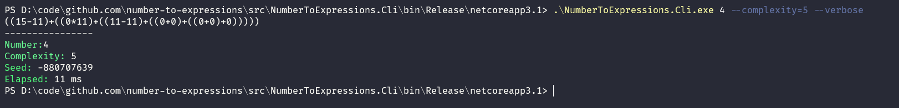

# number-to-expressions

Finds math expression with given complexity of a given number.

So basicly we destruct our number into small simple (+ / * -) operations and print it. Simple as it gets, right? Pretty much like that:

```
4 = (20+((4+0)-10)-10)
```

---

## Two ways too check it out:


### CLI
Simple run a cli like that. Don't be silly and do it like I said.

`NumberToExpressions.Cli.exe (number) [--complexity=4] [--seed] [--verbose]`

- **number** is a number
- **complexity** is how complex wee need to get
- **seed** well, we do have some psedu-randomness so to repeat the expression supply the seed for random
- **verbose** do you need some else stuff or not?



### WEB
Just go to the web-site and do some fun => https://number-to-expressions.herokuapp.com/
